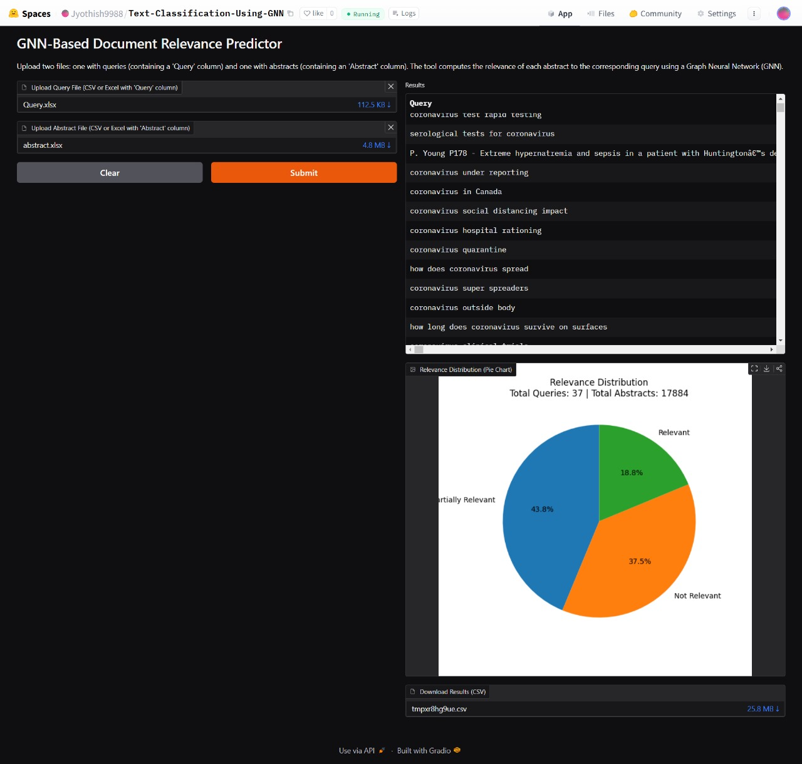
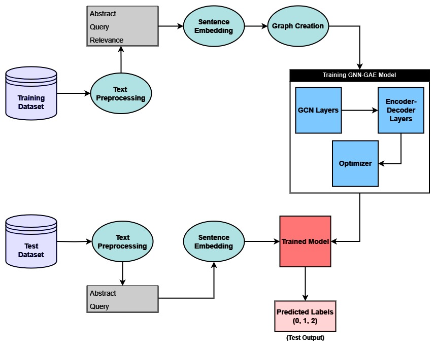
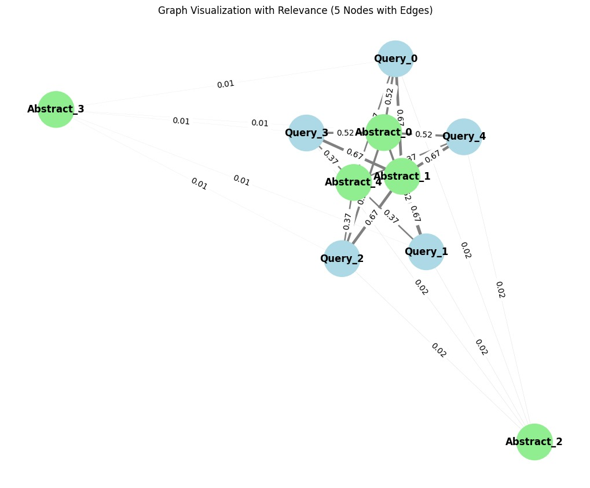
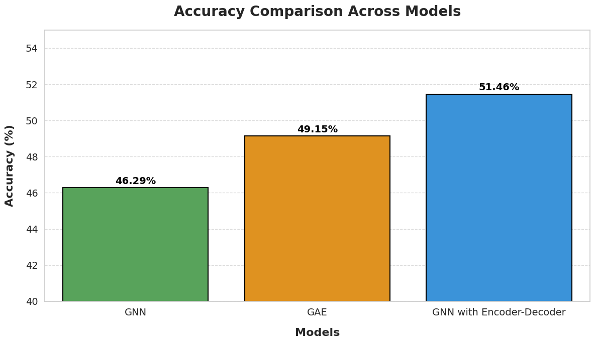

# GNN For Text Classification
 Applications which involve text classification may still need a breakthrough in capturing the latent structure in the text and more complex dependencies which limits its capacity to make correct predictions. This paper presents a new approach to a text classification application in which a hybrid graph representation learning algorithm has been used to demonstrate interactions between latent semantic and structural data in text documents. Text is represented as a graph, where a node represents a sentence and an edge represents the semantic relationship between two nodes. With nodes converted to embed- dings generated through Sentence-BERT, it offers contextualized representations for every node. Along with this framework, we also learn low-dimensional representations of the text graphs using Graph Auto Encoders. Our model thus enhances gen- eralization and has a powerful representation for downstream tasks by minimizing the difference between reconstructed and input graphs.Experimental results demonstrate that our model surpasses traditional methods by successfully integrating seman- tic and structural information to enhance classification accuracy. This work contributes to the advancement of GNN-based archi- tectures for text retrieval, demonstrating the potential of graphs in natural language processing.

Application Link :https://huggingface.co/spaces/Jyothish9988/Text-Classification-Using-GNN

<h3>Architecture</h3>

<h3>Graph Representation </h3>

<h3>Accuracy Comparison </h3>

In this section, we compare the performance of three models Graph Neural Network (GNN), Graph Autoencoder (GAE),and GNN with Encoder-Decoder in the task of classifying the relevance of query-document pairs. The task involves evaluating how well each model predicts the relevance of a document to a specific query. To conduct this evaluation, we used a subset of queries and their associated documents, considering the relevance of the documents as the actual labels. These labels indicate whether the document is relevant (labeled as 1), not relevant (labeled as 0) or partially relevant (labeledas 2) to the respective query.For each model, predictions were generated for a random sample of queries, and the associated documents were evaluated based on these predictions. The evaluation was conducted by comparing the predicted relevance against the actual labels.After generating the predictions for the sampled queries, the results were saved in a CSV file, which includes the query text,document text, actual label, and predicted label for each query document pair. These results were then used to assess the model’s performance by comparing the qrels and the predicted values. Comparison of Document Retrieval Models (GNN,GAE, and Encoder-Decoder) Against Actual Relevance for COVID-19 Queries The performance evaluation  of the models provide insightful information regarding their relative strengthsand weaknesses in predicting the relevance of query-document
pairs. Comparison of accuracy across GNN, GAE, and GNN with Encoder-Decoder models. As shown in the comparison given in Figure 11, the model that combines Graph Neural Networks (GNN) with an Encoder-Decoder architecture outperforms the other models, achieving an accuracy of 51.46%. This is followed by the Graph Autoencoder (GAE), with an accuracy of 49.15%, and the basic GNN model, which attains an accuracy of 46.29%. These findings underscore the significant impact of integrating encoder-decoder frameworks and autoencoding approaches, which appear to significantly boost the models’ ability to 10 better capture the underlying relationships between queries and
documents.